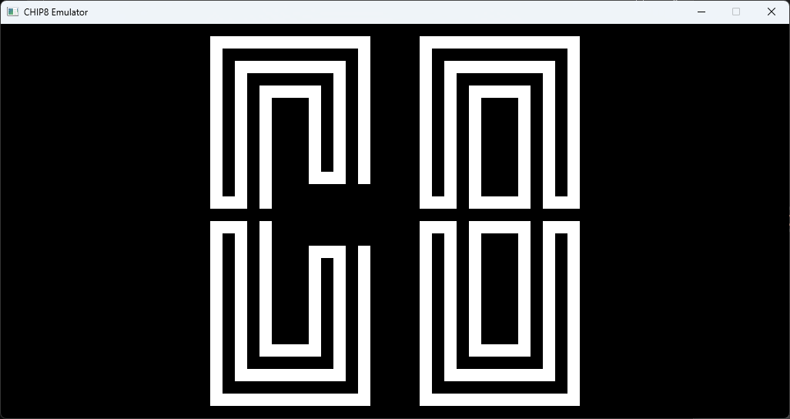

# CHIP-8

### Fully functional C++ Chip-8 Emulator



## How to use?

Use included CMake script to build and run. Launcher with GUI is in development. To select roms, volume and cycle delay command line arguments should be passed before running:

```./chip8.exe <rom_path> <volume> <cycle_delay>```

* `<volume>` - floating point value between 0.0 and 1.0
* `<rom_path>` - string value leading to ROM file (relative to executable location)
* `<cycle_delay>` - amount of milliseconds that emulator waits before executing next opcode. Its value should depend on chosen ROM to match desired speed.

## Dependencies

All dependencies are automatically downloaded via CMake script:

* [SDL2](https://github.com/libsdl-org/SDL)
* [sdplog](https://github.com/gabime/spdlog.git)
* [Catch2](https://github.com/catchorg/Catch2.git)

